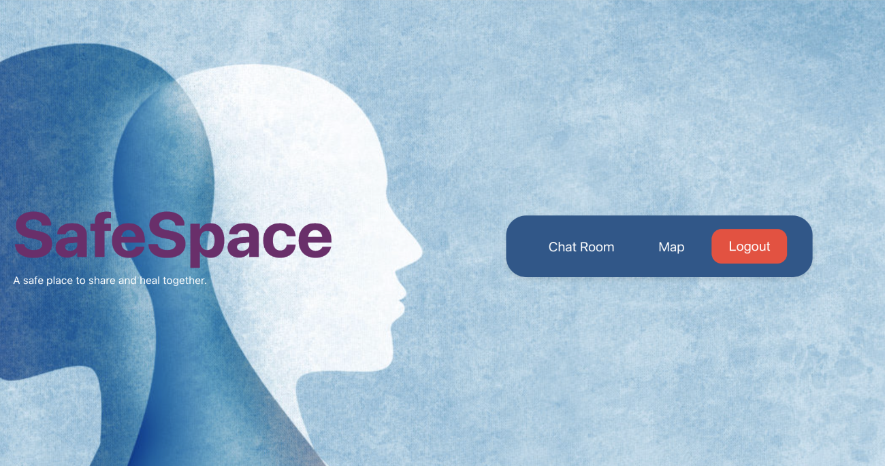
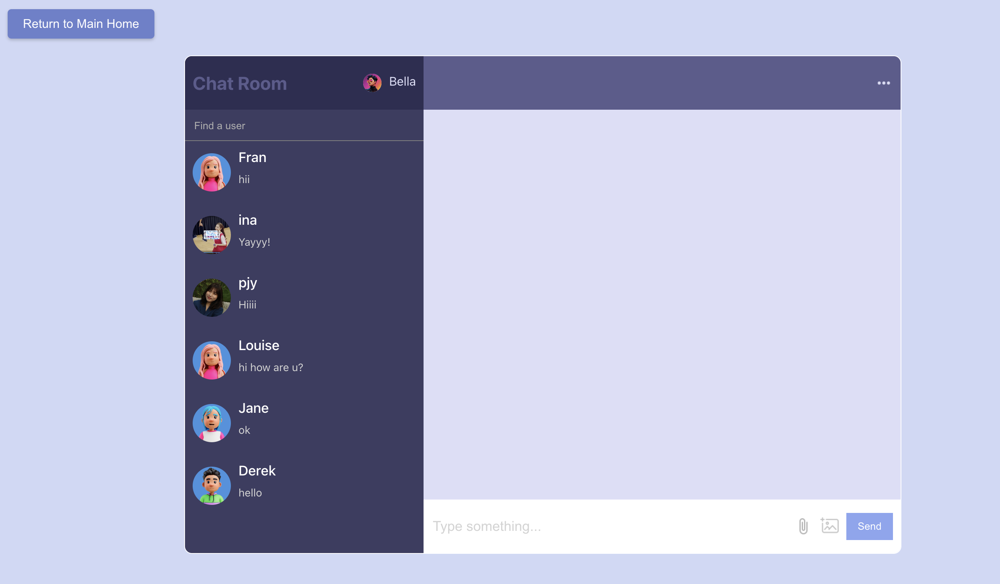
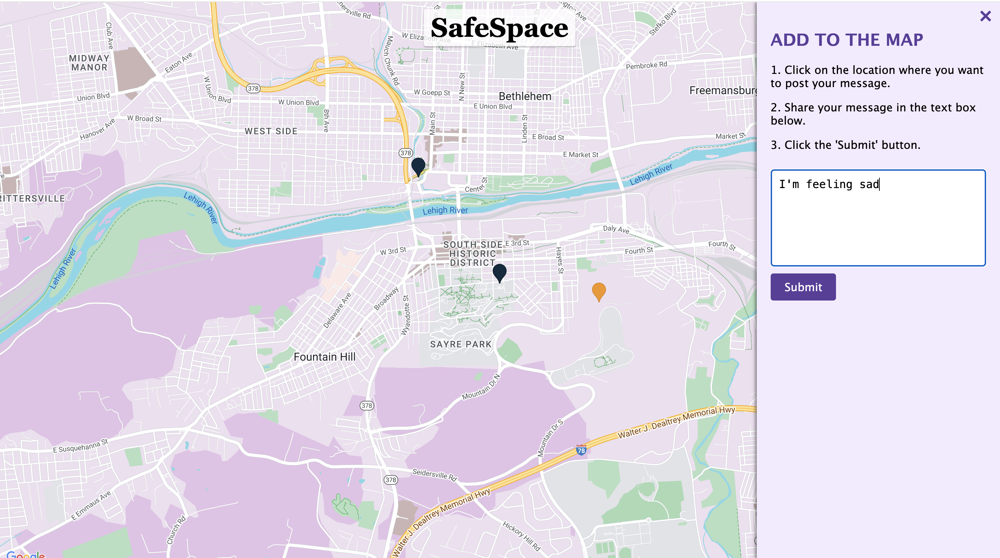
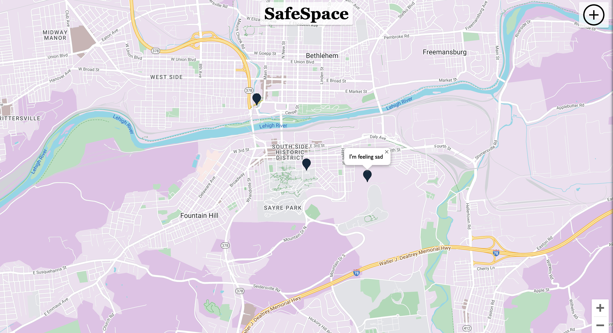

# Lehigh Hack for Health 2024

## Introduction

Lehigh Hack for Health 2024 is dedicated to addressing the critical issue of mental health among students at Lehigh University. Our innovative solution is an anonymous location-based map service designed to connect individuals facing similar mental health challenges. By fostering a supportive community where students can openly share and connect without the fear of stigma, we aim to create a safe space that promotes mental well-being.



## Features

- **Anonymous Communication**: Users can interact anonymously, ensuring privacy and comfort in sharing their experiences.
  

- **Location-Based Mapping**: Leveraging the Google Maps API, users can select and connect with peers in their vicinity, fostering a sense of community.
<p align="center" float="left">
   
   
</p>

- **Interest-Based Matching**: Users can post about their interests or concerns on the map, allowing others with similar interests to connect and start a conversation.
- **Real-Time Chat**: Our platform supports real-time messaging, enabling users to engage in meaningful conversations instantly.
- **Secure Authentication**: Utilizing Firebase and Google Cloud, we ensure that user information is securely managed and authenticated.
- **Data Privacy**: All chat messages are securely stored, ensuring that conversations remain private between the users involved.

## Technical Stack

- **Frontend**: HTML, CSS, JavaScript
- **Backend**: Firebase for user information storage and authentication
- **Database**: Firebase for storing chat messages
- **APIs**: Google Maps API for location services

## Setup Instructions

1. **Clone the Repository**

   ```bash
   git clone https://github.com/yourproject/lehigh-hack-for-health-2024.git
   cd lehigh-hack-for-health-2024
   ```

2. **Install Dependencies**

   Ensure you have Node.js installed, then run:

   ```bash
   npm install
   ```

3. **Configure Firebase and Google Cloud**

   - Create a Firebase project and enable authentication.
   - Set up Firestore for storing chat messages.
   - Obtain and configure your Google Maps API key.

4. **Environment Setup**

   Create a `.env` file at the root of your project and add your Firebase and Google Maps API keys:

   ```plaintext
   REACT_APP_FIREBASE_API_KEY=your_firebase_api_key
   REACT_APP_GOOGLE_MAPS_API_KEY=your_google_maps_api_key
   ```

5. **Start the Development Server**

   ```bash
   npm start
   ```

## Usage

- **Navigate the Map**: Open the application and use the map to find posts or people nearby who share similar interests or concerns.
- **Post on the Map**: Click on your location to add a post, sharing your thoughts or what you're seeking in a peer connection.
- **Connect and Chat**: Select a post that interests you to start an anonymous chat with the person behind it.

## Contributing

We welcome contributions from the community. Whether you have ideas for new features, improvements, or bug fixes, your input is valuable to us. Please follow the standard fork-and-pull request workflow. Ensure your code adheres to the project's coding standards and include tests where possible.

## Contact

Project Link: [https://github.com/ziw224/hack-for-health-2024](https://github.com/ziw224/hack-for-health-2024)

For any queries, please reach out to us at [zihan.wang@lehigh.edu](zihan.wang@lehigh.edu).

Thank you for supporting Lehigh Hack for Health 2024. Together, we can make a difference in the mental well-being of our student community.
